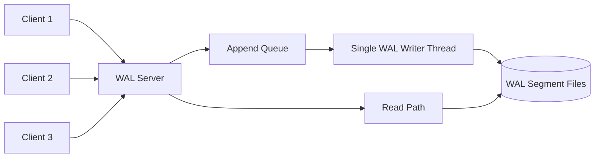
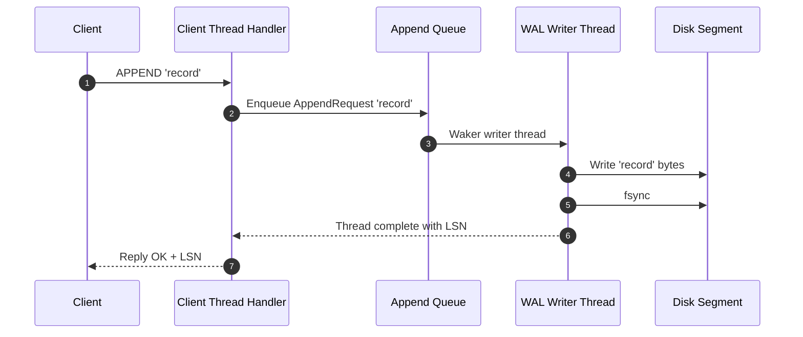

## High-Level Architecture

```mermaid

flowchart LR
    C1[Client 1]-->S[WAL Server]
    C2[Client 2]-->S
    C3[Client 3]-->S

    S-->Q[Append Queue]
    Q-->W[Single WAL Writer Thread]
    W-->F[(WAL Segment Files)]

    S-->R[Read Path]
    R-->F

```

## Append Flow

```mermaid

sequenceDiagram
    autonumber
    Client->>Client Thread Handler: APPEND 'record'
    Client Thread Handler->>Append Queue: Enqueue AppendRequest 'record'
    Append Queue->>WAL Writer Thread: Waker writer thread
    WAL Writer Thread->>Disk Segment: Write 'record' bytes
    WAL Writer Thread->>Disk Segment: fsync
    WAL Writer Thread-->>Client Thread Handler: Thread complete with LSN
    Client Thread Handler-->>Client: Reply OK + LSN

```