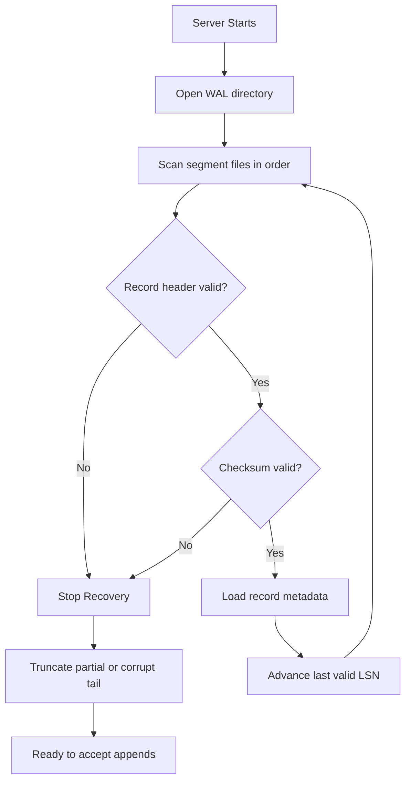

## Crash Recovery

```mermaid

flowchart TD
    S[Server Starts]-->WD[Open WAL directory]
    WD-->SC[Scan segment files in order]
    SC-->V{Record header valid?}
    V-- No -->STOP[Stop Recovery]
    V-- Yes -->CS{Checksum valid?}
    CS-- No -->STOP
    CS-- Yes -->LOAD[Load record metadata]
    LOAD-->ADV[Advance last valid LSN]
    ADV-->SC
    STOP-->TR[Truncate partial or corrupt tail]
    TR-->RDY[Ready to accept appends]

```