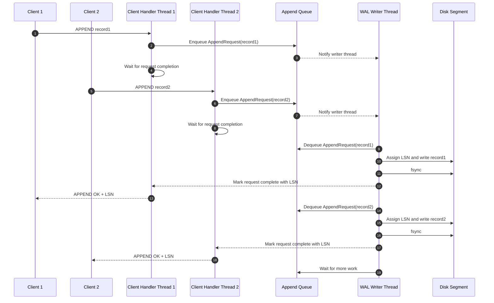
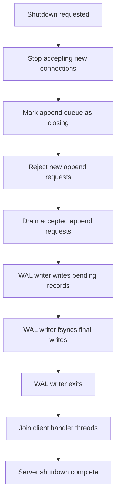

## Threading Model

The WAL server accepts concurrent client connections, but all WAL writes are serialized through a single writer thread. This keeps log ordering deterministic and prevents multiple threads from writing to the same WAL segment file at the same time.

The main design rule is:

> Only the WAL writer thread may write to WAL segment files.

Client handler threads are responsible for parsing client requests, creating append requests, submitting them to the append queue, and waiting for completion. The WAL writer thread owns the durable append path.

## Standard Append Flow



## Queue Ownership

The append queue is the synchronization boundary between client handler threads and the WAL writer thread.

Client handler threads may push requests into the queue. The WAL writer thread is the only thread that pops requests from the queue and writes them to disk.

The queue implementation will use a mutex and condition variable internally, but callers should not directly manage queue locks.

## Request Completion

Each append request contains enough state for the submitting client handler thread to wait until the WAL writer finishes the durable append.

A request is considered complete only after:

1. The record has been assigned an LSN.
2. The record bytes have been written to the active WAL segment.
3. The WAL segment has been flushed/synced according to the configured durability policy.
4. The request result has been stored for the waiting client handler thread.

The client receives `APPEND OK` only after the request is complete.

## Shutdown Flow



## Shutdown Rules

During shutdown, the server stops accepting new client connections first. Existing accepted append requests are allowed to finish if they have already entered the append queue.

New append requests submitted after the queue begins closing are rejected with a server-shutdown error.

The WAL writer thread exits only after all accepted append requests have either completed or failed in a controlled way.

## States

The server, append queue, and client handlers each have their own lifecycle states.

### Server States
```text
accepting -> closing -> draining -> flushing -> stopped
```
**accepting**: The server accepts new client connections and append requests.

**closing**: Shutdown has been requested. The server stops accepting new connections.

**draining**: Already accepted append requests are allowed to complete.

**flushing**: The WAL writer flushes final durable writes.

**stopped**: All worker threads have exited.

### Queue States
```text
open -> closing -> closed
```
**open**: New append requests may be enqueued.

**closing**: New append requests are rejected, but existing queued requests are drained.

**closed**: No new work is accepted and no queued work remains.

### Client Handler States
```text
active -> waiting -> completed -> closed
```
**active**: The handler is parsing or processing a client request.

**waiting**: The handler has submitted an append request and is waiting for the WAL writer.

**completed**: The handler has received the append result and can reply to the client.

**closed**: The client connection has been closed.